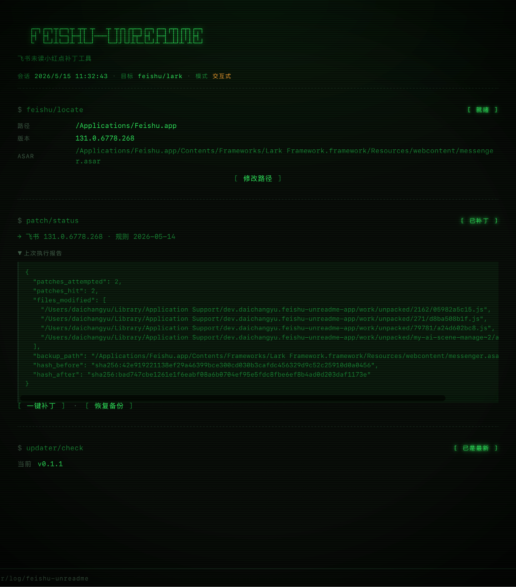

# feishu-unreadme-app

跨平台 GUI 版的飞书已读回执屏蔽工具,用 Tauri + Svelte + Rust 实现,支持 GitHub Releases 自更新。



## 使用教程

### 1. 安装

从 [Releases](https://github.com/Karl-Dai/feishu-unreadme-app/releases) 下载对应平台的安装包:

| 平台 | 文件 | 备注 |
|---|---|---|
| macOS Apple Silicon | `feishu-unreadme-app_*_aarch64.dmg` | M1/M2/M3 |
| macOS Intel | `feishu-unreadme-app_*_x64.dmg` | |
| Windows | `feishu-unreadme-app_*_x64-setup.exe` | 推荐,NSIS 安装器 |
| Windows (企业部署) | `feishu-unreadme-app_*_x64_en-US.msi` | |
| Linux (Debian/Ubuntu) | `feishu-unreadme-app_*_amd64.deb` | |
| Linux (Fedora/RHEL) | `feishu-unreadme-app-*.x86_64.rpm` | |

macOS 首次启动可能被 Gatekeeper 拦截,执行一次:

```bash
xattr -dr com.apple.quarantine /Applications/feishu-unreadme-app.app
```

### 2. 打补丁

1. **彻底退出飞书**
   - macOS: 顶部菜单 → 退出飞书,或 `Cmd+Q`。直接关闭窗口不算,飞书会留后台,`messenger.asar` 会被占用。
   - Windows: 系统托盘飞书图标右键 → 退出。
2. **启动 feishu-unreadme-app**。`feishu/locate` 一栏会自动扫描安装位置:
   - 显示 `[ 就绪 ]`:成功识别,继续下一步。
   - 显示 `[ 未找到 ]`:点 `[ 选择目录 ]`,手动定位 `Feishu.app` 或飞书安装目录。
3. **点 `[ 一键补丁 ]`**。`patch/status` 会从 `[ 未补丁 ]` → `[ 处理中 ]` → `[ 已补丁 ]`,详情显示 `飞书 <版本> · 规则 <日期>`。
4. **重启飞书**。未读消息小红点不再出现。

### 3. 状态对照

`patch/status` 状态徽章及对应操作:

| 徽章 | 含义 | 该做什么 |
|---|---|---|
| `[ 未补丁 ]` | 飞书原始状态 / 从未打过补丁 | 点 `[ 一键补丁 ]` |
| `[ 已补丁 ]` | 当前飞书已生效补丁 | 无需操作 |
| `[ 需重跑 ]` | 飞书升级覆盖了之前的补丁 | 重新点 `[ 一键补丁 ]` |
| `[ 不兼容 ]` | 飞书新版本规则未命中 | 等待本工具发新版,或自行提 issue |
| `[ 处理中 ]` | 正在写入 | 等几秒 |
| `[ 探测中 ]` | 初次启动尚未读取状态 | 等几秒 |

### 4. 飞书升级后

飞书会自动后台更新,任意一次更新都会覆盖补丁。重启飞书后回到 feishu-unreadme-app,如果显示 `[ 需重跑 ]`,再点一次 `[ 一键补丁 ]` 即可,无需重装。

### 5. 出问题恢复

#### 在应用内恢复

`patch/status` 卡片下方点 `[ 恢复备份 ]`,会把首次打补丁时备份的 `messenger.asar.bak` 还原为 `messenger.asar`。

#### 应用本身打不开 / 手动恢复

```bash
# macOS
cd "/Applications/Feishu.app/Contents/Frameworks/Lark Framework.framework/Resources/webcontent/"
mv messenger.asar messenger.asar.patched
mv messenger.asar.bak messenger.asar

# Windows (PowerShell)
cd "$env:LOCALAPPDATA\Feishu\resources"
Move-Item messenger.asar messenger.asar.patched
Move-Item messenger.asar.bak messenger.asar
```

#### 查看日志

主界面底部 `tail var/log/feishu-unreadme` 抽屉可展开,实时显示运行日志(`INFO` / `WARN` / `ERROR` 三级)。出问题时把 `ERROR` 行截图随 issue 提交。

### 6. 应用自更新

底部 `updater/check` 卡片会自动检查 GitHub Releases 上的 `latest.json`:

- `[ 已是最新 ]`:无需操作。
- `[ 有新版 ]`:显示 `当前 v0.1.x → 远端 v0.1.y`,点 `[ 下载并安装 ]`,minisign 签名校验通过后自动安装并重启。

### 7. 语言切换

顶部 meta 行末尾 `语言 中 | EN`,点击切换。选择写入 localStorage,关闭重开记住。

## 开发

```bash
pnpm install
pnpm tauri dev
```

跑测试:

```bash
cd src-tauri && cargo test
```

## 项目结构

详见 [docs/ARCHITECTURE.md](docs/ARCHITECTURE.md);完整设计见 [docs/spec.md](docs/spec.md)。

## 与原仓库的关系

由 Python CLI 版的 [`feishu-unreadme`](https://github.com/starccy/feishu-unreadme) 演化而来,原仓库继续可用但不再新增功能。

## License

MIT
